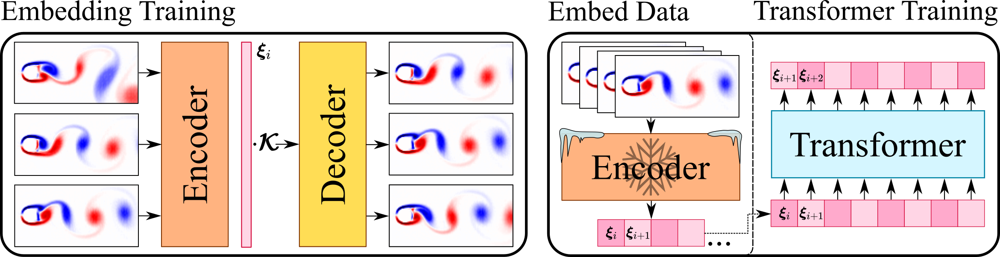

- [什么是大语言模型？](#什么是大语言模型)
  - [Transformer 的原理](#transformer-的原理)
- [使用 Transformer 来学习物理的语言 （比如马尔可夫链）](#使用-transformer-来学习物理的语言-比如马尔可夫链)
  - [Rapid detection of phase transitions from Monte Carlo samples before equilibrium](#rapid-detection-of-phase-transitions-from-monte-carlo-samples-before-equilibrium)
  - [CASK: A Gauge Covariant Transformer for Lattice Gauge Theory](#cask-a-gauge-covariant-transformer-for-lattice-gauge-theory)
  - [Self-learning Monte Carlo with equivariant Transformer](#self-learning-monte-carlo-with-equivariant-transformer)
  - [Equivariant Transformer is all you need](#equivariant-transformer-is-all-you-need)
  - [Transformers for modeling physical systems](#transformers-for-modeling-physical-systems)
    - [实现方法](#实现方法)
  - [使用 Transformer 来学习分子和蛋白质的语言的案例](#使用-transformer-来学习分子和蛋白质的语言的案例)
    - [Scientific Large Language Models: A Survey on Biological \& Chemical Domains](#scientific-large-language-models-a-survey-on-biological--chemical-domains)
      - [核心观点](#核心观点)

# 什么是大语言模型？

- https://www.nvidia.cn/glossary/large-language-models/

大语言模型 (LLM) 是一种深度学习算法，可以使用非常大的数据集来识别、总结、翻译、预测和生成内容。

大语言模型在很大程度上代表了一类名为Transformer网络的深度学习架构。Transformer模型是一种神经网络，通过追踪序列数据 (如本句中的单词) 中的关系学习上下文及其含义。

{width=80%}
[图片来源](https://indico.ihep.ac.cn/event/20002/contributions/136439/attachments/71259/86251/AI%E5%9F%BA%E7%A1%80%E5%8F%8A%E5%9C%A8%E9%AB%98%E8%83%BD%E7%89%A9%E7%90%86%E9%A2%86%E5%9F%9F%E7%9A%84%E5%BA%94%E7%94%A8.pdf)

Transformer由多个Transformer块 (也称为层) 组成。例如，Transformer具有自注意层、前馈层和归一化层，所有这些层协同发挥作用来解密输入内容，以便在推理时预测输出流。这些层可以进行堆叠，形成更深层的Transformer和强大的语言模型。Transformer最早由 Google 在 2017 年的论文“Attention Is All You Need”中提出。

{width=80%}

图 1: 转换器模型的工作原理。

有两项关键创新使得Transformer特别适合大语言模型：位置编码（Positional Encoding）和自注意力机制（Self-Attention）。

位置编码会嵌入输入内容在给定序列中的顺序。从本质上讲，有了位置编码，就可以不按顺序将句子中的单词输入到神经网络。

自注意力机制会在处理输入数据时为输入数据的每个部分分配一个权重。此权重表示相应输入内容在上下文中相对于其余输入内容的重要性。换句话说，模型不再需要向所有输入内容投入同样的注意力，而是可以专注于输入内容中真正重要的部分。这种关于神经网络需要关注输入内容的哪些部分的具体表示，是在模型筛选和分析大量数据的过程中逐渐学习到的。

将这两种技术加以结合，可以分析不同元素如何在长距离、非顺序的情况下相互影响和关联的微妙方式与上下文。

以非顺序方式处理数据的能力能够将复杂问题分解为多个较小的同步计算。自然，GPU 非常适合并行解决这些类型的问题，从而可以大规模处理大规模无标签数据集和庞大的Transformer网络。

## Transformer 的原理
Transformer tutorials:

- https://jalammar.github.io/illustrated-transformer/
- 中文翻译：https://blog.csdn.net/qq_36667170/article/details/124359818
- https://github.com/bentrevett/pytorch-seq2seq/
- https://github.com/hyunwoongko/transformer
- https://github.com/tensorflow/tensor2tensor

# 使用 Transformer 来学习物理的语言 （比如马尔可夫链）

Transformer 能够学习任何序列，在自然语言领域，序列就是一段文字，在物理领域，序列可以是一条马尔可夫链。

## Rapid detection of phase transitions from Monte Carlo samples before equilibrium

- https://arxiv.org/abs/2206.13137

传统蒙特卡洛模拟在相变研究中面临计算复杂度高、需长时间平衡采样的瓶颈问题。针对这一挑战，丁洁伟、唐浩金和余永基研究团队提出了一种融合深度学习的创新范式。该方法创新性地采用基于Transformer架构的深度学习模型，直接从系统未达到热力学平衡的蒙特卡洛组态样本中提取有效特征，实现了对相变临界温度的高精度预测。研究结果表明，双向长短期记忆网络和Transformer架构能够通过解析经典自旋系统的构型分布以及量子系统的格林函数等多元数据特征，在系统未达到热力学平衡的蒙特卡洛组态样本中学习并完成不同物相的分类识别，并以高精度定位相变临界点。

## CASK: A Gauge Covariant Transformer for Lattice Gauge Theory

- https://arxiv.org/abs/2501.16955

该论文《CASK：用于晶格规范理论的规范协变 Transformer》介绍了一种利用机器学习技术加速计算密集型晶格量子色动力学（QCD）模拟的突破性方法，同时保持基本物理原理。由东京大学和理化学研究所等日本著名机构的研究员 Yuki Nagai、Hiroshi Ohno 和 Akio Tomiya 开发，CASK（协变注意力与 Stout 核）代表了将 Transformer 架构应用于物理问题的重要进展。

晶格 QCD 计算，对于理解强核力和基本粒子至关重要，需要巨大的计算资源。这项研究解决了一个关键挑战：如何在保持规范对称性的同时利用机器学习来加速这些计算，规范对称性是一个必须保留以获得有意义结果的基本物理原理。CASK 架构通过设计一个本质上具有规范协变性的基于变换器的神经网络，巧妙地解决了这一矛盾。

## Self-learning Monte Carlo with equivariant Transformer

- https://arxiv.org/abs/2306.11527

本文由日本原子能机构的 Yuki Nagai 和国际专业技术大学的 Akio Tomiya 提出，介绍了一种将 SLMC 框架与等变 Transformer 架构相结合的新方法，以显著提高物理系统的蒙特卡洛模拟。这项工作的关键创新是引入了一个尊重所模拟物理系统基本对称性的等变 Transformer 模型。通过这样做，作者展示了蒙特卡洛模拟在精度和效率方面的显著提升，尤其是在凝聚态物理中的双交换模型方面。

## Equivariant Transformer is all you need

- https://arxiv.org/abs/2310.13222

在一份开创性的论文中，研究人员秋本昭夫和永井优希提出了一种将机器学习与计算物理学概念相结合的新方法。他们的论文《等变 Transformer 是你所需要的》介绍了一种创新的方法，该方法结合了 Transformer 神经网络的力量与物理对称性原理，以显著提高模拟效率。

机器学习、深度学习正在加速计算物理学的发展，这已被用于模拟晶格上的系统。等变性对于模拟物理系统至关重要，因为它为机器学习模型描述的概率分布施加了强烈的归纳偏差。这降低了因偏离数据对称性和物理定律而导致的错误外推的风险。然而，在自学习蒙特卡罗（SLMC）中强加对称性有时会导致低接受率。另一方面，在 GPT 等 Transformer 中使用的注意力实现了大模型容量。我们引入了对称等变注意力到 SLMC 中。为了评估我们的架构，我们将它应用于我们提出的二维晶格上的自旋费米子模型的新架构。我们发现它克服了线性模型的低接受率，并观察到了接受率的缩放规律，就像在具有 Transformer 的大型语言模型中一样。

## Transformers for modeling physical systems

- https://arxiv.org/abs/2010.03957
- https://github.com/zabaras/transformer-physx

物理系统的建模传统上依赖于数值求解微分方程，这通常计算成本高昂。能够高效近似这些系统的代理模型已成为需要大量模拟的应用的关键工具。尼古拉斯·日内瓦和尼古拉斯·扎巴拉斯的论文《用于建模物理系统的 Transformer》介绍了一种新颖的方法，通过将最初为自然语言处理（NLP）开发的 Transformer 模型应用于建模复杂的动力学物理系统。

这项研究在科学机器学习领域迈出了重要一步，弥合了擅长捕捉序列数据长距离依赖关系的 Transformer 架构与模拟随时间演变的物理现象之间的差距。与之前采用循环神经网络（RNN）或长短期记忆（LSTM）网络的方法不同，这项工作利用了 Transformer 的并行处理能力和注意力机制，更有效地模拟物理动力学。

### 实现方法

为了使此类动力系统的建模适用于现代机器学习架构的使用，连续解在空间和时间域上被离散化，使得微分方程的解为 $\Phi = \left( \phi_0, \phi_1, \ldots, \phi_T \right)$；其中 $\phi_i \in \mathbb{R}^{n \times d}$，且 $\phi_i$ 在 $\Omega$ 上被 $d$ 个点离散化。我们假设初始状态为 $\phi_0$，并且时间区间 $\mathcal{T}$ 被 $T$ 个时间步离散化，时间步长为 $\Delta t$。因此，我们将动力系统的建模问题转化为一个时间序列问题。所提出的机器学习方法有两个核心组件：用于建模动力学的Transformer和用于将物理状态投影为向量表示的嵌入网络。与自然语言处理（NLP）类似，嵌入模型在Transformer之前进行训练。然后，该嵌入模型被冻结，整个数据集被转换为嵌入空间，随后在嵌入空间中训练Transformer，如图1所示。在测试期间，嵌入解码器用于从Transformer的预测中重建物理状态。

{width=80%}

图 2: 使用变压器建模物理动力学的两个训练阶段。（从左到右）首先使用 Koopman 动力学训练嵌入模型。然后冻结（固定）嵌入模型，将所有训练数据嵌入，并在嵌入空间中训练变压器。

## 使用 Transformer 来学习分子和蛋白质的语言的案例

- https://github.com/HICAI-ZJU/Scientific-LLM-Survey

### Scientific Large Language Models: A Survey on Biological & Chemical Domains

https://arxiv.org/abs/2401.14656

大型语言模型（LLMs）的近期进展已经改变了自然语言处理，但它们在特定科学领域中的应用，尤其是在生物学和化学领域，面临着独特的挑战和机遇。科学大型语言模型（Sci-LLMs）旨在理解和生成科学语言，范围从专业符号系统到复杂的分子结构、蛋白质序列和基因组数据。

如图所示，科学大语言模型在多个模态上运行，包括文本、分子、蛋白质和基因组数据，多模态方法位于这些领域的交汇处。与主要在自然语言文本上训练的通用目的模型不同，科学大语言模型必须理解科学的独特“语言”，包括专门的符号系统（如分子的 SMILES）和生物序列中发现的复杂模式。

{width=80%}

图 3: 本调查中科学大型语言模型（Sci-LLMs）的研究范围。我们关注科学语言（即文本、分子、蛋白质和基因组语言），以及它们在生化科学领域的组合（即多模态语言）。

#### 核心观点

- 通用LLMs只能处理自然语言，无法妥善处理分子和蛋白质等科学数据。

> 除了自然语言之外，为了封装更多的专门科学知识，开发了一系列科学语言，如图 1 所示。这包括科学研究领域的文本表达、定义数学公式的数学语言、表示分子结构的化学语言（如 SMILES）以及描述蛋白质或基因组的生物语言，并详细描述了生物体的复杂构成。这些科学语言有自己的词汇表，其中每个术语都有特定的含义，可能与自然语言完全不同。例如，在英语中，“C”字符在蛋白质语言中代表半胱氨酸（GDR 等，1984），而在 SMILES 语言系统中则表示碳原子（Weininger，1988）。此外，特定领域的专家制定了组织这些术语的语法规则，从而构建具有精确语义功能的句子。例如，计算化学家制定了语法规则，以确保 SELFIES 格式的机器生成分子的准确性（Krenn 等，2020）。 经过几十年的发展，科学语言已成为不可或缺的工具，极大地加速了科学发现。由于科学语言和自然语言之间可能存在语义和语法差异，现有的通用LLMs（如 ChatGPT 1 或 GPT-4 (OpenAI, 2023)）往往无法妥善处理分子和蛋白质等科学数据（AI4Science and Quantum, 2023）。正如著名的奥地利哲学家路德维希·维特根斯坦所指出的，“我的语言的界限意味着我的世界的界限。”（Ramsey, 1923）通用LLMs的世界可能局限于自然语言。

